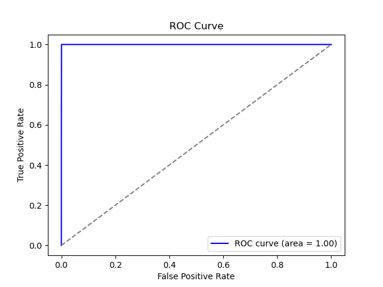
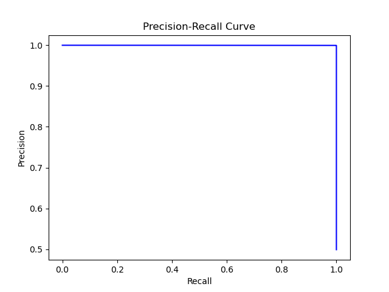
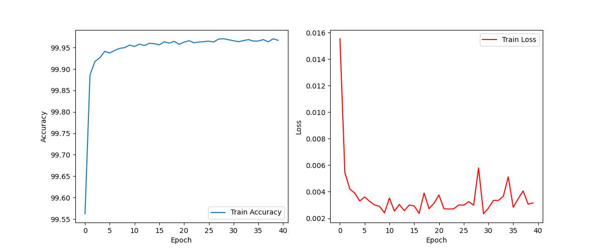

# Credit Card Fraud Detection

## Project Overview
This project uses a deep learning neural network in PyTorch to detect fraudulent credit card transactions. The dataset used is highly imbalanced, and techniques like **SMOTE** (Synthetic Minority Over-sampling Technique) are applied to improve the model’s ability to detect fraudulent transactions. The model achieves high accuracy and precision, particularly for detecting fraud.

## Dataset
- **Source**: [Kaggle - Credit Card Fraud Detection Dataset](https://www.kaggle.com/mlg-ulb/creditcardfraud)
- **Size**: 284,807 transactions, 492 fraud cases (0.172% fraud)
- **Features**: 28 anonymized variables (V1-V28), Time, Amount
- **Target**: Binary classification (0 = Non-Fraud, 1 = Fraud)

## Key Features of the Project
- **SMOTE** for handling class imbalance.
- **Neural Network**: A 5-layer deep learning model built using PyTorch.
- **Metrics**: Achieved an AUC-ROC score of 1.00, test accuracy of 96.69%, and a balanced precision-recall performance.

## Results
- **Test Accuracy**: 99.95%
- **Precision, Recall, F1-Score**: Excellent recall and precision for both classes.
- **AUC-ROC**: Achieved a perfect AUC-ROC score of 1.00, indicating the model’s strong performance in distinguishing fraud from non-fraud cases.

## Visualizations

## How to Run
1. Clone the repository: `git clone https://github.com/yourusername/Data-Science-Projects`
2. Navigate to the project folder: `cd Credit-Card-Fraud-Detection`
3. Install required packages: `pip install -r requirements.txt`
4. Run the notebook: `jupyter notebook notebooks/fraud_detection.ipynb`

## Dependencies
- `numpy`, `pandas`, `matplotlib`, `torch`, `sklearn`, `imblearn`

## License
This project is provided under the MIT License. See LICENSE for more details.

## Contact
Feel free to reach out with any questions via [email](mailto:apolyzoidis@hotmail.com).
