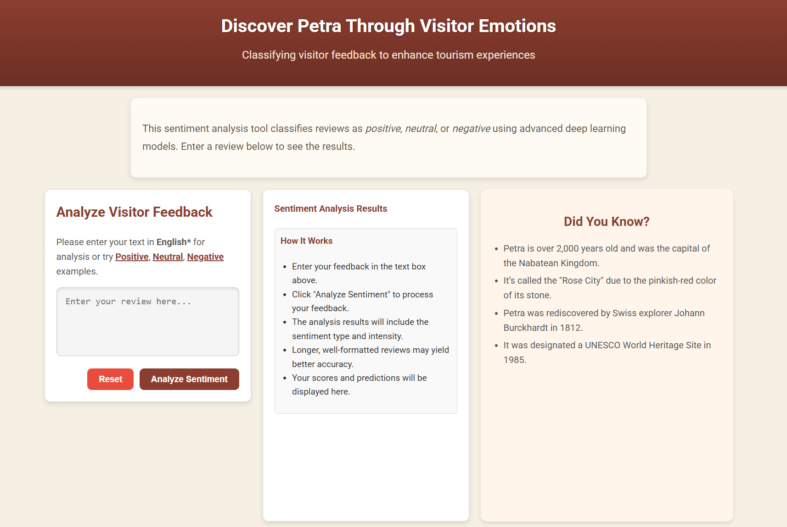
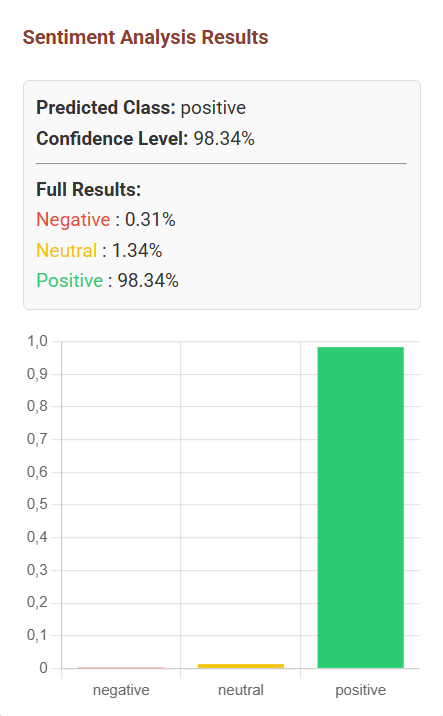

# Petra Reviews Sentiment Analysis

**An end-to-end AI application that leverages sentiment analysis on visitor reviews of Petra, a UNESCO World Heritage Site. The project aims to enhance tourism experiences and support informed decision-making for stakeholders.**

---

## 🚀 Key Features

- **Sentiment Classification**: Classifies visitor feedback into positive, neutral, or negative categories with ~90% accuracy.
- **Hugging Face Transformers**: Tested multiple transformer-based architectures to achieve the best possible performance.
- **User-Friendly Interface**: Interactive web interface for sentiment analysis and trend visualization.
- **Containerized Deployment**: Fully Dockerized for streamlined deployment and scalability.

---

## 🛠️ Tech Stack

- **Frontend**: HTML, CSS, JavaScript, Chart.js, Font Awesome
- **Backend**: FastAPI, Jinja2, PyTorch, Transformers (Hugging Face), Pydantic
- **Infrastructure**: Docker, Heroku (for deployment)
- **Tools**: Python, NumPy, Matplotlib

---

## 📊 Model Performance

- **Accuracy**: Achieved close to 90% on the test set.
- **Transformer Models Tested**:
  - BERT
  - DistilBERT
  - RoBERTa
  - Twitter-RoBERTa (Optimal model)
- **Training Framework**: PyTorch

---

## 🖥️ Deployment

The project is deployed using Docker and hosted on Heroku. You can visit the live demo [here](https://www.petrareviewsai.com).

# 📝 Project Description

This project utilizes advanced **sentiment analysis** techniques to classify visitor feedback into three categories: **positive**, **neutral**, or **negative**. By analyzing these insights, tourism stakeholders can make data-driven decisions to improve visitor experiences and better promote Petra as a destination.

---

## **Key Objectives**

- Enhance tourism experiences using sentiment data.
- Provide actionable insights for decision-makers in the tourism sector.

---

## 📷 **Screenshots**

### **Main Interface:**

### **Sentiment Results:**

---

## 🤝 **Acknowledgments**

- **Data Source**: Google Maps and TripAdvisor visitor reviews.
- **Libraries and Tools**: Hugging Face Transformers, PyTorch, Docker, Heroku.
- **Inspiration**: Tourism insights and data-driven decision-making.

---

## 📬 **Contact**

For inquiries or collaborations, feel free to connect with me on:
- **GitHub**: [AlexandrosPol](https://github.com/AlexandrosPol)
- **LinkedIn**: [Alexandros Polyzoidis](https://linkedin.com/in/alexandros-polyzoidis)
   

