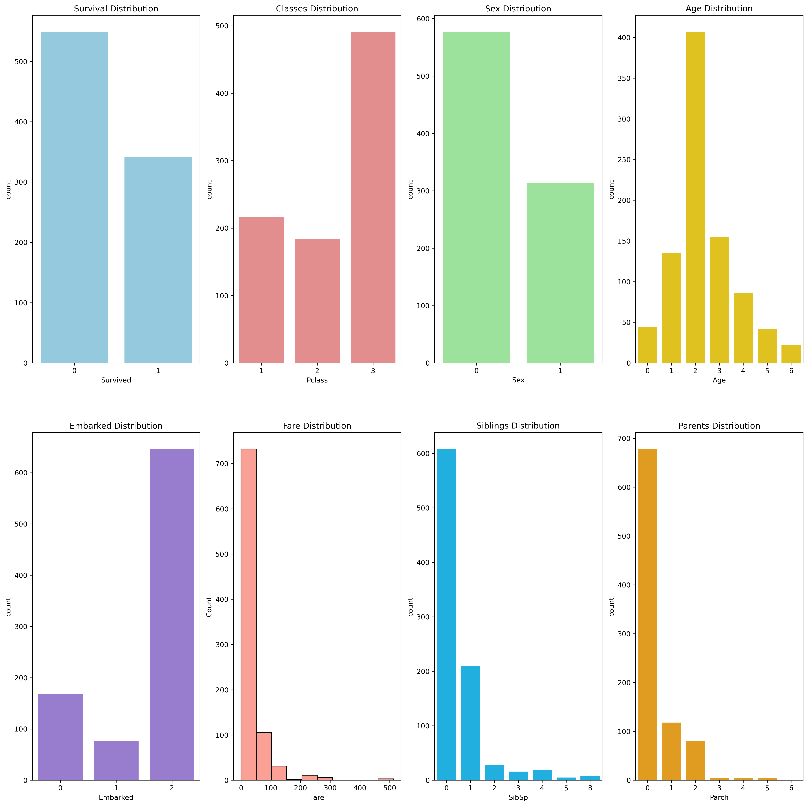
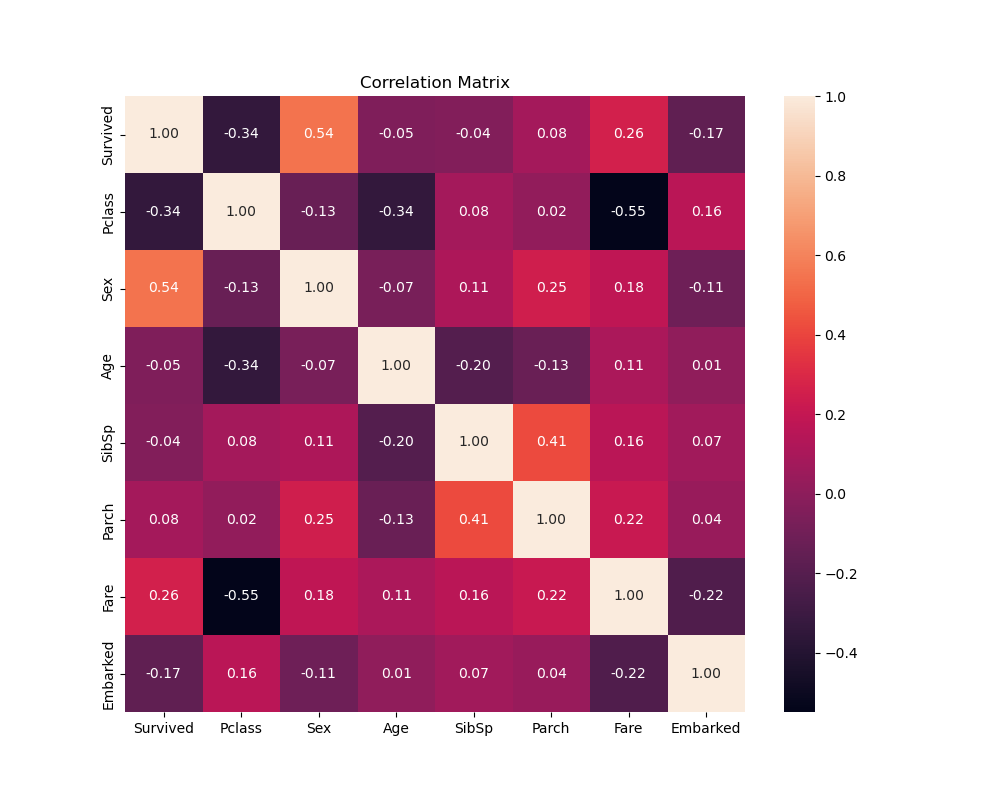
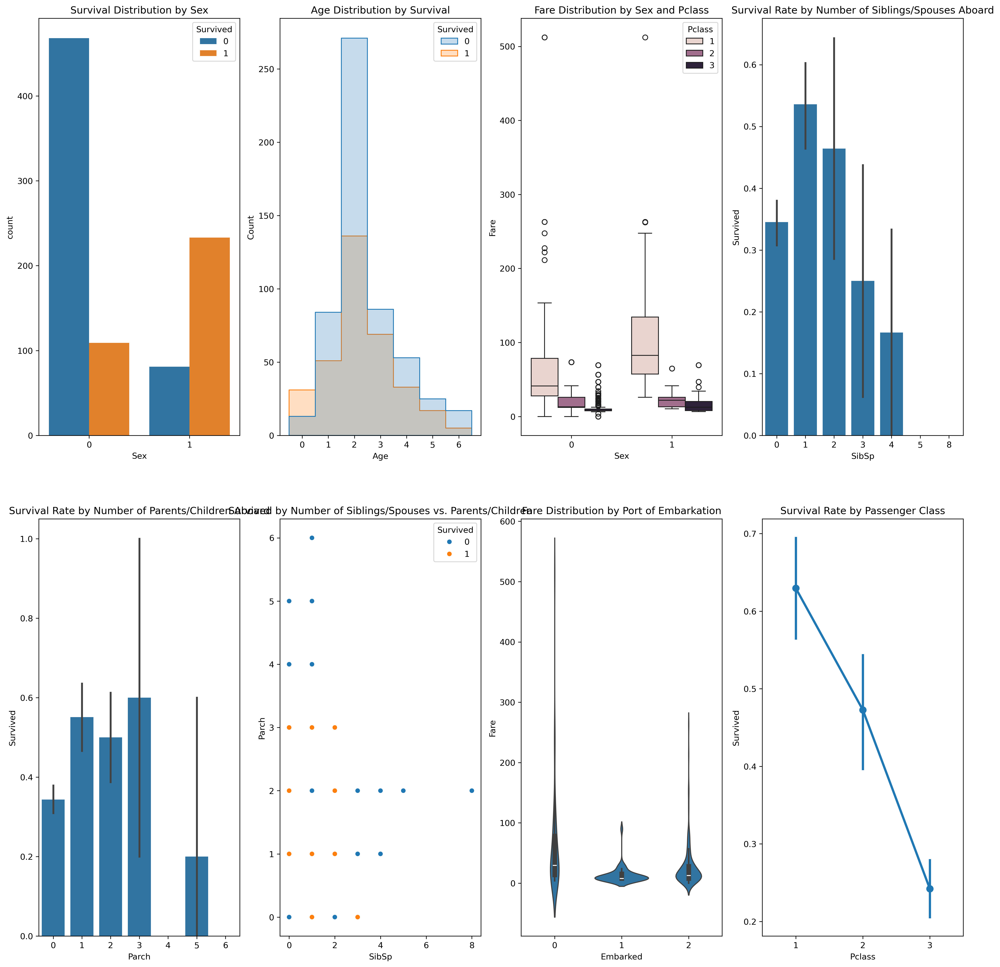

# Project: Titanic Survival Prediction

## Objective
- Predict the survival of passengers on the Titanic based on features such as passenger class, sex, age, number of siblings/spouses, parents/children on board, fare, and port of embarkation.
- Identify factors that influenced survival rates to provide insights into societal dynamics and emergency responses.

## Dataset
- Dataset: [Titanic dataset on Kaggle](https://www.kaggle.com/c/titanic/data)
- The dataset contains various features that may influence the survival rates of passengers.

## Tools Needed
- **Programming Language**: Python
- **Libraries**: `pandas`, `numpy`, `scikit-learn`, `matplotlib`, `seaborn`

## Project Steps

### Step 1: Define the Problem
The Titanic disaster is one of the most infamous shipwrecks in history. This project aims to analyze which types of people were likely to survive using machine learning to predict survival based on various characteristics.

### Step 2: Data Collection
- Loaded the Titanic dataset as a pandas DataFrame for analysis and feature engineering.

### Step 3: Data Wrangling and Preprocessing
- **Dropping Irrelevant Features**: Removed columns unlikely to affect survival or with excessive missing data.
- **Handling Missing Values**: Imputed missing values for `Age` and `Embarked` features.
- **Type Casting**: Converted data types for consistency.
- **Encoding Categorical Features**: Converted `Sex` and `Embarked` into numerical categories.
- **Age Binning**: Grouped `Age` into categories for better insights.

### Step 4: Exploratory Data Analysis (EDA)
- Analyzed distributions of various features to understand patterns and relationships.

#### Visualizations

- **EDA Overview**: 
- **Correlation Matrix**: 
- **Feature Relationships**: 

### Step 5: Feature Engineering
- **Label Encoding**: Converted categorical features to numerical values for model compatibility.
- **Scaling**: Applied feature scaling for uniform range across features.

### Step 6: Model Selection and Training
- **Models Evaluated**:
  - Logistic Regression
  - Decision Tree Classifier
  - Support Vector Machine (SVM)
  - K-Nearest Neighbors (KNN)
- **Hyperparameter Tuning**: Used GridSearchCV for optimal parameter selection, particularly for the Decision Tree model.

### Step 7: Model Evaluation
- Compared model accuracies on the validation set:
  - Logistic Regression: 80%
  - Decision Tree: 81% (Best-performing model)
  - SVM: 80%
  - KNN: 78%

### Step 8: Testing and Final Model Selection
- Decision Tree Classifier selected as the final model due to its balance of interpretability and performance.

### Step 9: Prediction and Feature Importance
- Predicted survival outcomes on the test set and analyzed feature importance based on the Decision Tree model.

### Conclusion
After thorough analysis and modeling, the Decision Tree Classifier was chosen for its ability to capture non-linear relationships between features. Key findings from this project include:
- **Socio-economic Status**: Higher class passengers had higher survival chances.
- **Gender Bias**: Females had a higher survival rate due to the "women and children first" policy.
- **Family Size**: Smaller family groups had higher survival rates.

This analysis highlights the predictive power of machine learning for historical data and offers potential insights into emergency response protocols.

### Future Work
- Test other advanced models like Random Forest or Gradient Boosting.
- Fine-tune hyperparameters further for enhanced accuracy.
- Explore additional sources of data to enrich the analysis.

---

> **Note**: Visualizations are provided based on EDA and relationships analysis. For a complete set of code and additional details, please refer to the [Jupyter Notebook](https://github.com/AlexandrosPol/Data-Science-Projects/blob/main/Titanic%20Survival%20Prediction/Titanic%20Survival%20Prediction.ipynb).
